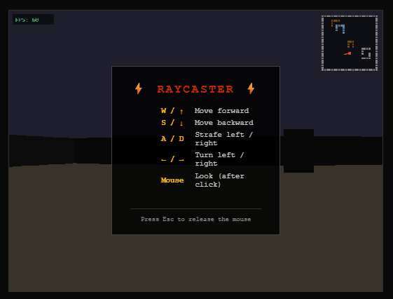

# ⚡ Doom-Style Raycaster

A classic Wolfenstein/Doom-style 3-D FPS built entirely in vanilla JavaScript and HTML5 Canvas — no dependencies, no build step, just open and play.



---

## 🚀 How to run

**Option 1 — open directly (quickest)**
```
double-click index.html
```

**Option 2 — local dev server (avoids `file://` quirks in some browsers)**
```bash
python3 -m http.server 8080
# then visit http://localhost:8080
```
```bash
npx serve .
# then visit http://localhost:3000
```

---

## 🎮 Controls

| Key | Action |
|-----|--------|
| `W` / `↑` | Move forward |
| `S` / `↓` | Move backward |
| `A` | Strafe left |
| `D` | Strafe right |
| `←` / `→` | Turn left / right |
| **Mouse** | Look around — click the canvas to capture, `Esc` to release |

---

## 🏗️ Architecture

Five files, no framework:

```
map.js → player.js → renderer.js → game.js
                                        ↑
                                   index.html
```

| File | Role |
|------|------|
| `map.js` | 24 × 24 world grid; wall types, colours, `isWall()` helper |
| `player.js` | Position, angle, WASD / arrow / mouse input, axis-split collision |
| `renderer.js` | DDA raycasting engine, sprite projection, z-buffer, minimap |
| `game.js` | `requestAnimationFrame` loop, sprite list, FPS counter, crosshair |
| `index.html` | Canvas, instructions overlay, loads scripts in dependency order |

### Raycasting highlights

- **DDA algorithm** — one ray per screen column; O(map diameter) per frame.
- **Fish-eye correction** — perpendicular wall distance instead of Euclidean ray length.
- **Wall shading** — N/S vs E/W faces use different base colours; distance-based brightness darkens far walls.
- **Sprite occlusion** — per-column z-buffer prevents enemies from drawing over nearer walls.
- **Minimap** — live top-down overlay with player dot and direction line.

---

## ✨ Extending

| Goal | Where to edit |
|------|--------------|
| New wall type | Add entry to `MAP.WALL_COLORS`, use new integer in `MAP.grid` |
| New sprite look | Add case to `RENDERER._spriteSample(type, tx)` |
| Place an enemy | Push `{ x, y, type }` into `GAME.sprites` |
| Tweak feel | `PLAYER.MOVE_SPEED`, `PLAYER.MOUSE_SENS`, `RENDERER.FOV` |

---

[](https://claude.ai/code)
